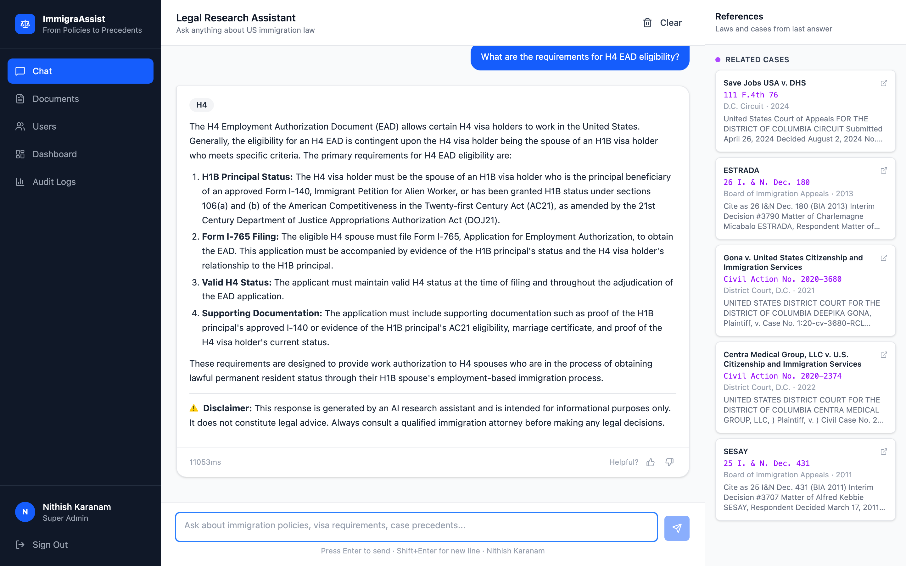
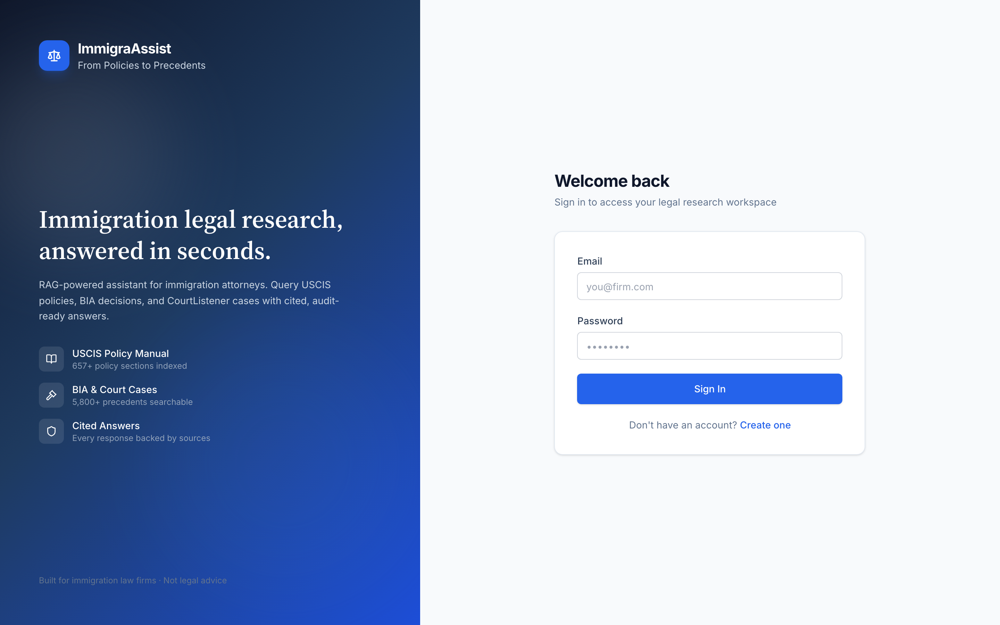
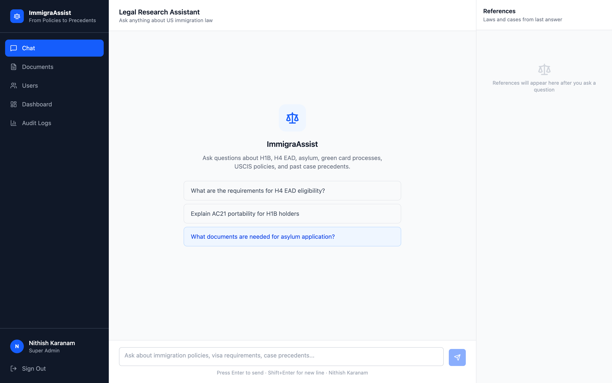

# ImmigraAssist

> AI-powered immigration legal research for law firms — USCIS policies, BIA precedents, and court cases with cited answers.

[](http://157.230.51.229)
[](https://python.org)
[](https://fastapi.tiangolo.com)
[](https://react.dev)
[](https://docker.com)
[](https://smith.langchain.com)
[](LICENSE)

**[Live Demo](http://157.230.51.229)** · **[GitHub](https://github.com/Nithishkaranam2002/ImmigraAssist)** · **[Report Bug](https://github.com/Nithishkaranam2002/ImmigraAssist/issues)**

---

## Table of Contents

- [Live Demo](#live-demo)
- [Screenshots](#screenshots)
- [What is ImmigraAssist?](#what-is-immigraassist)
- [Key Features](#key-features)
- [Architecture](#architecture)
- [Knowledge Base](#knowledge-base)
- [Evaluation & Metrics](#evaluation--metrics)
- [Quick Start](#quick-start)
- [API Reference](#api-reference)
- [User Roles](#user-roles)
- [Project Structure](#project-structure)
- [Environment Variables](#environment-variables)
- [Security & Secrets](#security--secrets)
- [Development](#development)
- [Author](#author)
- [License & Disclaimer](#license--disclaimer)

---

## Live Demo

| | |
|---|---|
| **URL** | [http://157.230.51.229](http://157.230.51.229) |
| **Email** | `nithish@immigraassist.com` |
| **Password** | `test1234` |

> Demo account is **admin** — you can access chat, matters, eval dashboard, policy alerts, audit logs, and team management.

**Try these questions in Chat:**

- *What are the requirements for H4 EAD eligibility?*
- *Compare H-1B vs O-1 for a software engineer*
- *Explain AC21 portability for H-1B holders*

Answers typically take **15–30 seconds** while the system retrieves policies, case law, and CourtListener decisions.

---

## Screenshots

### Landing page



### Login



### Research Chat — home



### Research Chat — cited answer


> **More screenshots:** Run `node scripts/capture-screenshots.mjs` to regenerate images from the live app (matters, eval dashboard, review queue, policy alerts, visa hubs).

---

## What is ImmigraAssist?

ImmigraAssist is a **production-grade RAG (Retrieval-Augmented Generation)** platform built for immigration law firms. It turns hours of manual research into seconds by combining live USCIS data, indexed precedents, and GPT-4o with strict citations and attorney guardrails.

**Built for real firm workflows:**

| Workflow | How ImmigraAssist helps |
|----------|-------------------------|
| Quick research | Ask any visa/policy question in natural language |
| Client matters | Organize research per client with case notes injected into AI |
| Document review | Paste petition drafts for attorney-style doc Q&A |
| Quality control | Low-confidence answers flagged in Review Queue |
| Compliance | Full audit trail of every query, latency, and feedback |
| Policy monitoring | USCIS news/alert scraper with admin Policy Alerts feed |

---

## Key Features

### Research Chat
- **Streaming answers** with confidence badges (high / medium / low)
- **10-turn session memory** — follow-ups like *"What forms for that?"* inherit prior topic
- **Compare mode** — side-by-side visa pathway analysis (H-1B vs O-1, etc.)
- **Doc Q&A** — paste client document text for review-mode analysis
- **References panel** — cited USCIS chapters, BIA cases, CourtListener decisions
- **Export memo** — download research as a text memo
- **Thumbs up/down feedback** per answer

### Matters (case files)
- Create matters with **client name, visa type, and case notes**
- **Research** button opens chat scoped to that matter
- AI injects **case notes into every prompt** for personalized answers (e.g. Maria Garcia H-4 EAD)
- **Save to matter** — start in general chat, then attach research to a new or existing matter
- Matter detail page with **research history** and quick prompts

### Visa Research Hubs
- Pre-built hubs for H-1B, H-4, asylum, green card, and more
- Suggested questions per visa type
- One-click jump to chat with a pre-filled prompt

### Admin & Operations
- **Evaluation Dashboard** — live metrics (15s refresh): query volume, latency p50/p95, confidence, satisfaction, cache hits, review queue, recent activity
- **Review Queue** — attorney approval for low-confidence answers
- **Policy Alerts** — USCIS news/policy changes detected by scrapers
- **Audit Logs** — full query history with response times and token counts
- **Documents admin** — ingestion status and corpus management
- **Team management** — invite links with role assignment

### RAG Pipeline
- **Hybrid retrieval** — Milvus dense vectors + BM25 keyword search + RRF fusion
- **CourtListener** live federal court case search
- **Visa type detection** — auto-tags H-1B, H-4, asylum, etc.
- **Semantic cache** — Redis-backed response cache for repeated queries
- **PII guardrails** — GLiNER entity redaction (optional)
- **LangSmith tracing** — full LLM pipeline observability

### Security & Access
- **JWT authentication** with role-based access control
- **Invite-only signup** for firm team members
- Roles: `junior_associate`, `attorney`, `admin`, `super_admin`

---

## Architecture

```
User Query
    │
    ▼
FastAPI Backend
    │
    ├── Session context (10-turn memory, topic switch detection)
    ├── Matter context (client case notes injection)
    ├── Metadata filter (visa type detection)
    │
    ├── Parallel Retrieval
    │   ├── Milvus dense vector search (policies + cases)
    │   ├── BM25 keyword search
    │   └── CourtListener live search
    │
    ├── RRF reranking + context builder
    ├── GPT-4o (structured answer + citations)
    ├── Confidence scoring + quality gaps
    ├── PII sanitization
    └── Audit log + optional Review Queue flag
```

### Tech Stack

| Layer | Technology |
|-------|------------|
| Backend | FastAPI, Python 3.12, SQLAlchemy |
| LLM | OpenAI GPT-4o |
| Vector DB | Milvus 2.4 |
| Embeddings | text-embedding-3-small |
| Relational DB | PostgreSQL 16 |
| Cache / Queue | Redis 7 + Celery |
| Scraping | Playwright (USCIS), httpx (CourtListener) |
| Retrieval | Hybrid dense + BM25 + RRF |
| Guardrails | GLiNER (PII), content moderator |
| Observability | LangSmith |
| Frontend | React 19, TypeScript, Tailwind CSS, Vite |
| State | Zustand + TanStack Query |
| Serving | Nginx reverse proxy |
| Deploy | Docker Compose (9 services) |

---

## Knowledge Base

| Source | Documents | Vectors (approx.) |
|--------|-----------|-------------------|
| USCIS Policy Manual | 66+ chapters | 657+ |
| BIA / AAO case decisions | 244 | 5,860 |
| USCIS news & policy alerts | 20+ | ~80 |
| **Total** | **330+** | **6,500+** |

Scrapers run on a **Celery schedule** (daily news, weekly full scrape) with MD5 change detection — only updated content is re-ingested.

---

## Evaluation & Metrics

| Metric | Value | Notes |
|--------|-------|-------|
| RAGAS Answer Relevancy | **0.840** | 20 immigration law test cases |
| Avg response time | **~11s** | Production (varies by query) |
| Confidence scoring | High / Medium / Low | Based on sources + answer completeness |
| Live dashboard | 15s polling | Real DB metrics at `/eval` |

Run RAGAS locally:

```bash
cd backend
python tests/test_ragas.py
```

---

## Quick Start

### Prerequisites

- Docker Desktop (or Docker + Docker Compose)
- OpenAI API key

### 1. Clone

```bash
git clone https://github.com/Nithishkaranam2002/ImmigraAssist.git
cd ImmigraAssist
```

### 2. Configure secrets (never commit `.env`)

```bash
cp backend/.env.example backend/.env
```

Edit `backend/.env`:

```env
OPENAI_API_KEY=sk-your-key-here
SECRET_KEY=generate-a-long-random-string
ADMIN_EMAIL=admin@yourfirm.com
ADMIN_PASSWORD=your-strong-password
LANGCHAIN_API_KEY=your-langsmith-key-optional
```

### 3. Start

```bash
docker compose up -d
```

Wait ~60–90 seconds for Postgres, Milvus, Redis, and backend to become healthy.

### 4. Open

```
http://localhost
```

Login with your `ADMIN_EMAIL` / `ADMIN_PASSWORD` from `.env`.

### 5. Ingest corpus (first run)

```bash
# Login and get token
curl -X POST http://localhost/api/v1/auth/login \
  -H "Content-Type: application/json" \
  -d '{"email": "admin@yourfirm.com", "password": "yourpassword"}'

# Trigger scrape (replace TOKEN)
curl -X POST "http://localhost/api/v1/admin/scrape/trigger?scrape_policy=true&scrape_news=true&scrape_bia=true" \
  -H "Authorization: Bearer TOKEN"
```

First ingestion takes **15–20 minutes**.

---

## API Reference

| Method | Endpoint | Description |
|--------|----------|-------------|
| `POST` | `/api/v1/auth/login` | Login |
| `POST` | `/api/v1/auth/register` | Register (with invite token) |
| `POST` | `/api/v1/chat/query` | Ask a question |
| `POST` | `/api/v1/chat/query/stream` | Streaming chat |
| `POST` | `/api/v1/chat/doc-query` | Document Q&A |
| `GET` | `/api/v1/platform/history` | Query history |
| `GET` | `/api/v1/platform/eval-metrics` | Eval dashboard data |
| `GET` | `/api/v1/platform/reviews` | Review queue |
| `GET` | `/api/v1/platform/alerts` | Policy alerts |
| `GET` | `/api/v1/matters/` | List matters |
| `POST` | `/api/v1/matters/attach-research` | Save chat to matter |
| `POST` | `/api/v1/admin/scrape/trigger` | Trigger scrapers |
| `GET` | `/health` | Health check |

Interactive docs: `http://localhost/api/v1/docs` (when `DEBUG=True`).

---

## User Roles

| Feature | Junior | Attorney | Admin |
|---------|:------:|:--------:|:-----:|
| Research Chat | ✅ | ✅ | ✅ |
| Matters | ✅ | ✅ | ✅ |
| Visa Hubs | ✅ | ✅ | ✅ |
| Doc Q&A / Compare / Export | ✅ | ✅ | ✅ |
| Review Queue (approve/reject) | ❌ | ✅ | ✅ |
| Documents / Team / Audit | ❌ | ❌ | ✅ |
| Eval Dashboard / Policy Alerts | ❌ | ❌ | ✅ |

---

## Project Structure

```
ImmigraAssist/
├── backend/
│   ├── app/
│   │   ├── api/v1/routes/     # chat, matters, platform, admin, auth
│   │   ├── db/models/         # User, Matter, AuditLog, PolicyAlert, etc.
│   │   ├── guardrails/        # PII, content moderation
│   │   ├── ingestion/         # Chunking, embedding pipeline
│   │   ├── llm/               # GPT client, prompts, response parser
│   │   ├── retrieval/         # Hybrid retriever, reranker, context builder
│   │   ├── scrapers/          # USCIS policy, news, BIA, CourtListener
│   │   ├── services/          # Session context, confidence, answer quality
│   │   └── tasks/             # Celery scrape + ingest tasks
│   ├── tests/                 # RAGAS evaluation
│   └── .env.example           # Template only — copy to .env
├── frontend/
│   ├── src/pages/             # Chat, Matters, Eval, Alerts, etc.
│   ├── src/components/        # UI, chat, matters, eval charts
│   └── src/services/          # API clients
├── docs/                      # README screenshots
├── scripts/                   # capture-screenshots.mjs
└── docker-compose.yml
```

---

## Environment Variables

| Variable | Required | Description |
|----------|----------|-------------|
| `OPENAI_API_KEY` | ✅ | OpenAI API key |
| `SECRET_KEY` | ✅ | JWT signing secret (use a long random string) |
| `ADMIN_EMAIL` | ✅ | Bootstrap super-admin email |
| `ADMIN_PASSWORD` | ✅ | Bootstrap super-admin password |
| `POSTGRES_*` | ✅ | PostgreSQL connection |
| `MILVUS_HOST` | ✅ | Milvus vector DB host |
| `REDIS_HOST` | ✅ | Redis host |
| `LANGCHAIN_API_KEY` | Optional | LangSmith tracing |
| `COURTLISTENER_API_TOKEN` | Optional | Higher CourtListener rate limits |
| `COHERE_API_KEY` | Optional | Cohere reranker |
| `INTEGRATION_API_KEY` | Optional | External integration auth |

Full list: [`backend/.env.example`](backend/.env.example)

---

## Security & Secrets

### Are your API keys safe?

**Yes — if you follow these rules (which this repo is set up for):**

| Check | Status |
|-------|--------|
| `backend/.env` in `.gitignore` | ✅ Not committed to GitHub |
| Only `.env.example` with placeholders in repo | ✅ Safe |
| Real API keys in source code | ✅ None found |
| OpenAI / LangSmith keys in git history | ✅ None committed |
| Secrets loaded via environment variables | ✅ `app/config.py` |
| Production `.env` on server only | ✅ Mounted via Docker, not in image |

### What IS in the public repo (intentional)

| Item | Risk | Notes |
|------|------|-------|
| Demo login `test1234` | Low | Public demo account only — change for real deployments |
| `docker-compose.yml` default `postgres123` | Medium | Change `POSTGRES_PASSWORD` in production `.env` |
| `backend/.env.example` placeholders | None | Templates only |

### Best practices for production

1. **Never commit** `backend/.env` — it is gitignored
2. Use a **strong `SECRET_KEY`** (32+ random characters)
3. **Rotate** OpenAI and LangSmith keys if ever exposed
4. Change **demo admin password** on public droplets
5. Restrict **CORS_ORIGINS** to your domain
6. Set `DEBUG=False` in production
7. Use **HTTPS** (TLS certificate on Nginx)

### If a key was ever leaked

1. Revoke the key in OpenAI / LangSmith / CourtListener dashboards
2. Generate a new key
3. Update `backend/.env` on the server only
4. Restart: `docker compose up -d --build backend`

---

## Development

### Local (without Docker)

```bash
# Backend
cd backend && python -m venv .venv && source .venv/bin/activate
pip install -r requirements.txt
uvicorn app.main:app --reload --port 8000

# Frontend
cd frontend && npm install && npm run dev

# Celery
cd backend && celery -A celery_worker worker --loglevel=info
```

### Docker

```bash
docker compose up -d
docker compose logs -f backend
docker compose ps
docker compose down
```

### Regenerate README screenshots

```bash
node scripts/capture-screenshots.mjs
```

Optional env overrides:

```bash
SCREENSHOT_BASE_URL=http://157.230.51.229 \
SCREENSHOT_EMAIL=your@email.com \
SCREENSHOT_PASSWORD=yourpass \
node scripts/capture-screenshots.mjs
```

---

## Built With

- [FastAPI](https://fastapi.tiangolo.com) · [Milvus](https://milvus.io) · [OpenAI GPT-4o](https://openai.com)
- [LangSmith](https://smith.langchain.com) · [RAGAS](https://docs.ragas.io) · [CourtListener](https://courtlistener.com)
- [Playwright](https://playwright.dev) · [Celery](https://docs.celeryq.dev) · [GLiNER](https://github.com/urchade/GLiNER)
- [React](https://react.dev) · [Tailwind CSS](https://tailwindcss.com) · [TanStack Query](https://tanstack.com/query)

---

## Author

**Nithish Karanam**

- MS Artificial Intelligence, University of North Texas
- NVIDIA Certified — NCP-AAI & Generative AI LLMs Associate
- [GitHub](https://github.com/Nithishkaranam2002) · [LinkedIn](https://linkedin.com/in/nithishkaranam) · [Portfolio](https://nithishkaranam.lovable.app)

---

## License & Disclaimer

**MIT License** — see [LICENSE](LICENSE).

ImmigraAssist is an AI **research assistant**, not a lawyer. All outputs require **attorney review** before client use. Not legal advice.
