# ImmigraAssist

> AI-powered immigration legal research for law firms — USCIS policies, BIA precedents, and court cases with cited answers.

[](http://157.230.51.229)
[](https://python.org)
[](https://fastapi.tiangolo.com)
[](https://react.dev)
[](https://docker.com)
[](https://smith.langchain.com)
[](LICENSE)

**[Live Demo](http://157.230.51.229)** · **[GitHub](https://github.com/Nithishkaranam2002/ImmigraAssist)** · **[Report Bug](https://github.com/Nithishkaranam2002/ImmigraAssist/issues)**

---

## Table of Contents

- [Live Demo](#live-demo)
- [App Tour — Screenshots](#app-tour--screenshots)
- [What is ImmigraAssist?](#what-is-immigraassist)
- [Key Features](#key-features)
- [Architecture](#architecture)
- [Knowledge Base](#knowledge-base)
- [Evaluation & Metrics](#evaluation--metrics)
- [Quick Start](#quick-start)
- [API Reference](#api-reference)
- [User Roles](#user-roles)
- [Project Structure](#project-structure)
- [Environment Variables](#environment-variables)
- [Security & Secrets](#security--secrets)
- [Development](#development)
- [Author](#author)
- [License & Disclaimer](#license--disclaimer)

---

## Live Demo

| | |
|---|---|
| **URL** | [http://157.230.51.229](http://157.230.51.229) |
| **Email** | `nithish@immigraassist.com` |
| **Password** | `test1234` |

> Demo account is **admin** — full access to chat, matters, eval dashboard, policy alerts, audit logs, and team management.

**Try in Chat:**

- *What are the requirements for H4 EAD eligibility?*
- *Compare H-1B vs O-1 for a software engineer*
- *Explain AC21 portability for H-1B holders*

---

## App Tour — Screenshots

*Captured from production — June 2026. Regenerate anytime with `node scripts/capture-screenshots.mjs`.*

### Public pages

#### Landing page (`/`)

Marketing homepage with live demo link, feature highlights, and tech stack.

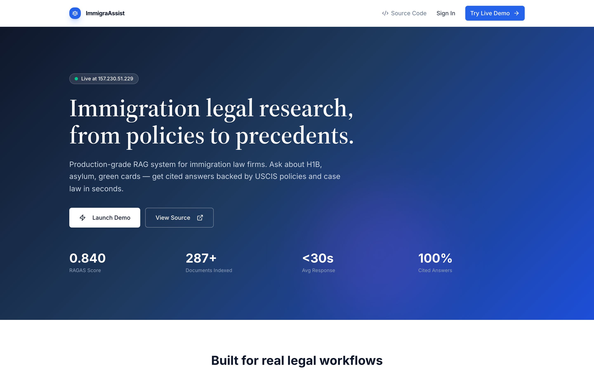

#### Login (`/login`)

Secure JWT login for firm team members.


---

### Research Chat (`/chat`)

#### Chat home

Suggested immigration questions and session memory. Start research without selecting a matter.


#### Chat — cited answer

Streaming AI answer with confidence badge, policy sources, case precedents, and CourtListener decisions. References panel on the right.


#### Save to matter

After research without a matter selected, save the full session to a new or existing client matter.

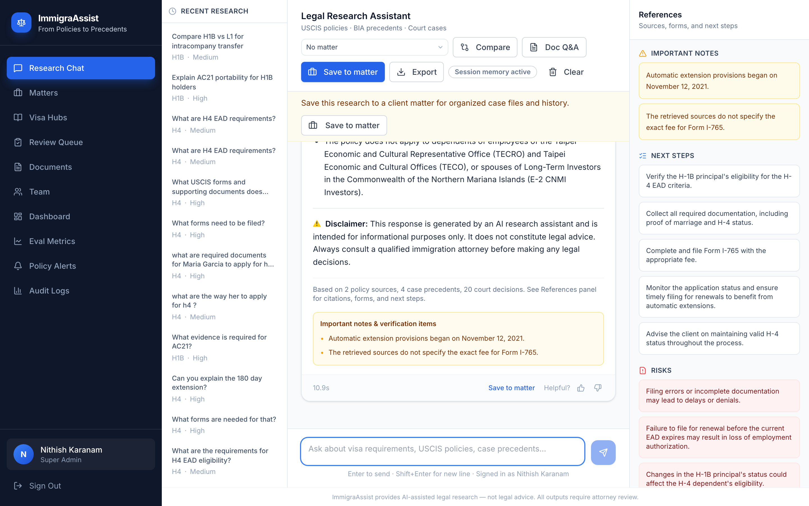

---

### Matters (`/matters`)

#### Matters list

Client case files with visa type, case notes, query counts, and quick research actions.

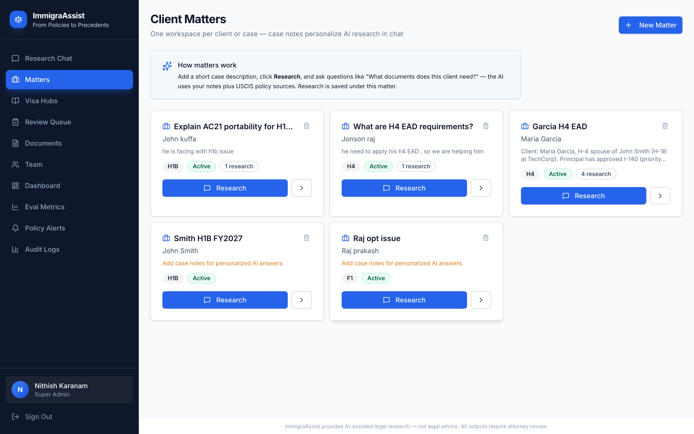

#### Matter detail (`/matters/:id`)

Edit case notes (injected into AI context), quick prompts, and matter-scoped research history.

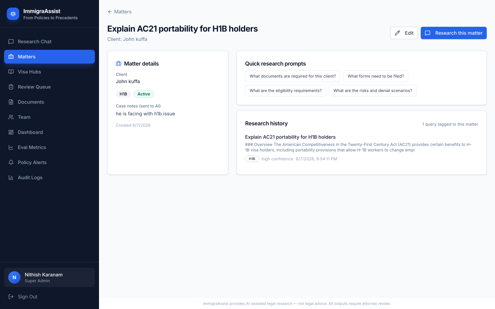

---

### Visa Research Hubs (`/research`)

#### Research hubs

Browse visa categories — H-1B, H-4, asylum, green card, and more.

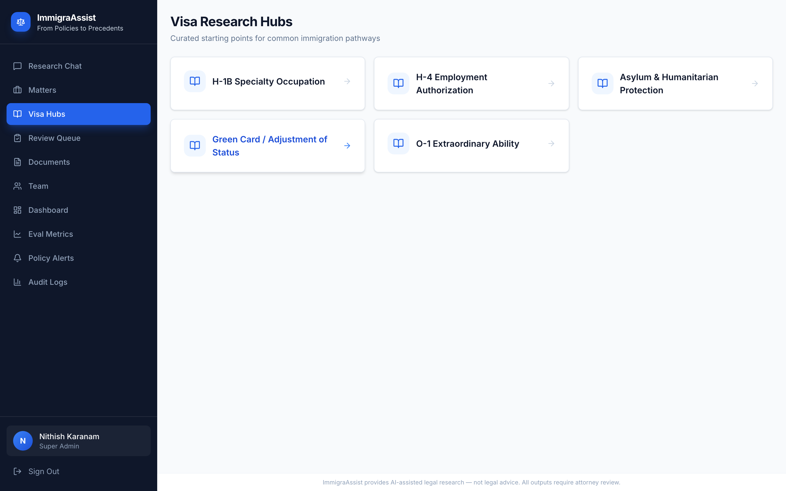

#### H-1B hub (`/research/h1b`)

Suggested questions per visa type with one-click jump to chat.

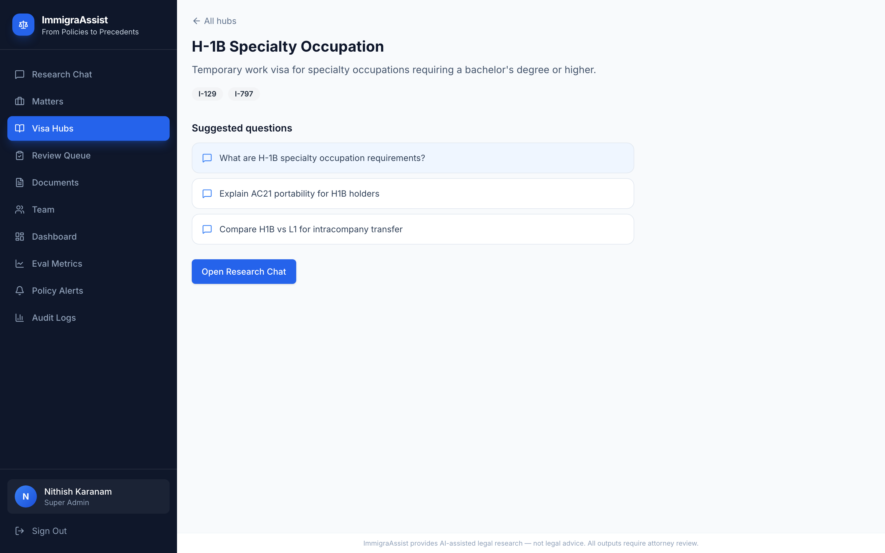

---

### Quality & Operations (Admin)

#### Evaluation Dashboard (`/eval`)

Live metrics (15s refresh): query volume, latency p50/p95, confidence, satisfaction, cache hits, review queue, charts, and recent activity.

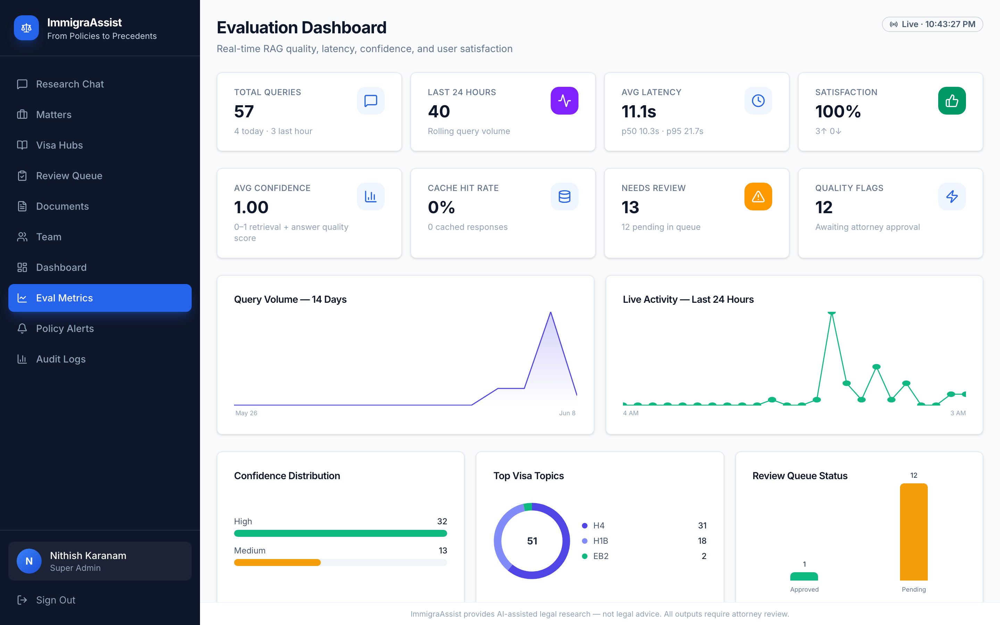

#### Review Queue (`/reviews`)

Low-confidence answers flagged for attorney approve/reject before client use.

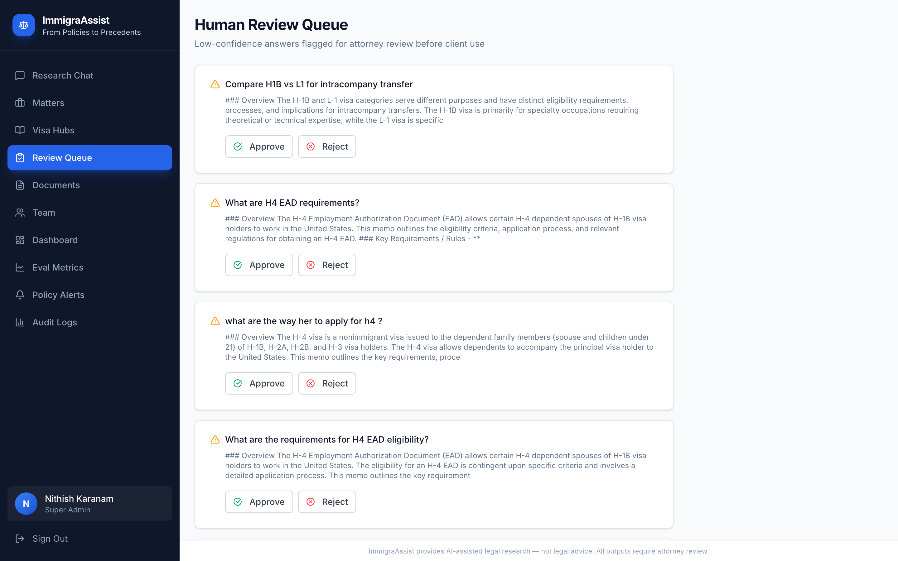

#### Policy Alerts (`/alerts`)

USCIS news and policy manual updates detected by automated scrapers.

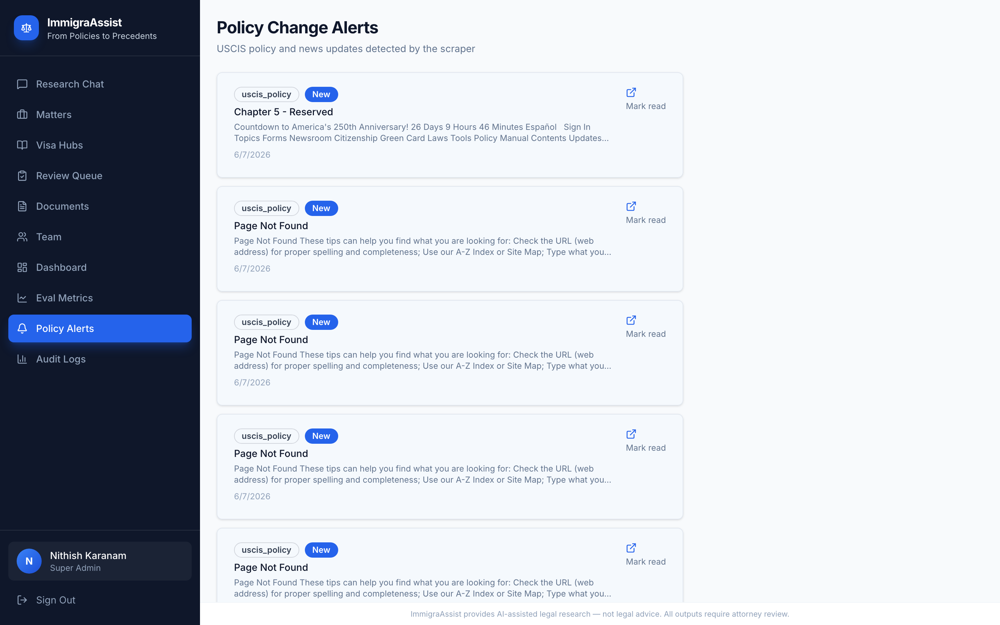

#### Documents (`/documents`)

Corpus ingestion status — USCIS policies, BIA cases, and scrape progress.

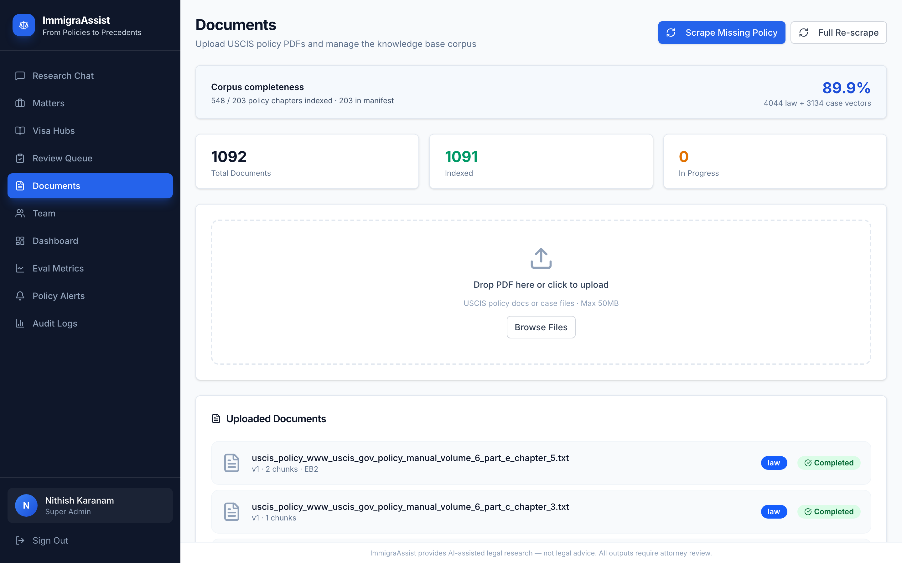

#### Admin Dashboard (`/admin`)

System stats, scraper controls, and service health.

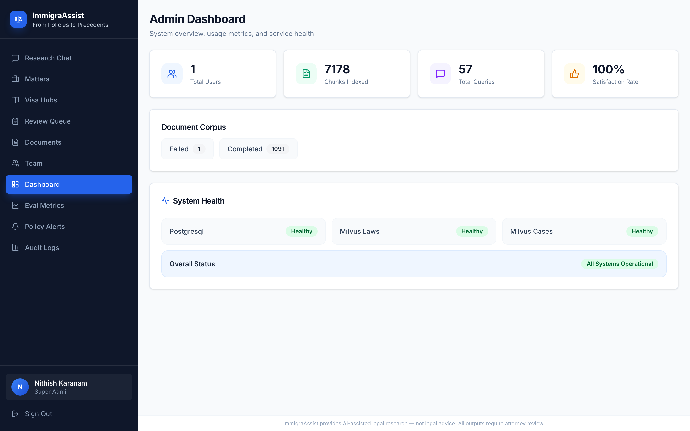

#### Team (`/users`)

Invite links with role assignment — attorney, junior associate, admin.

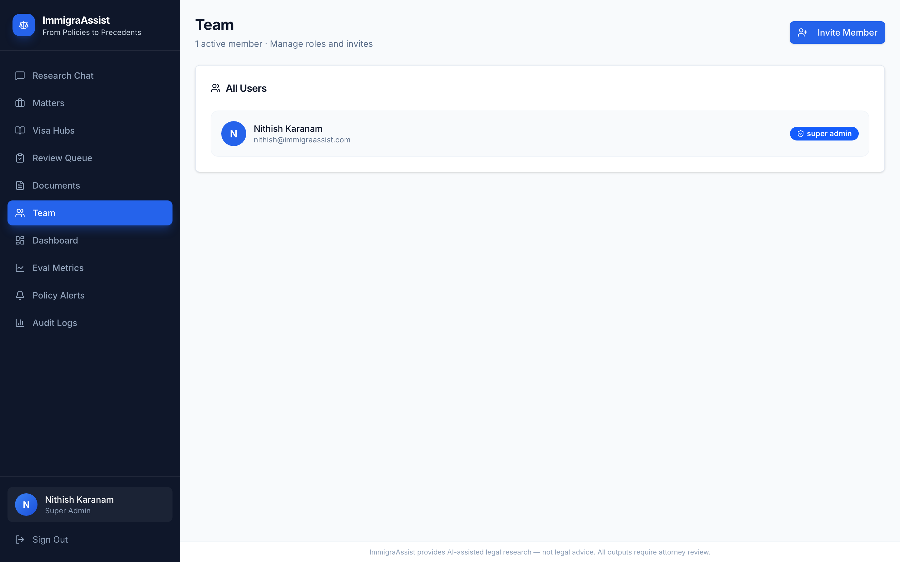

#### Audit Logs (`/audit`)

Full query history with response times, token counts, and compliance trail.

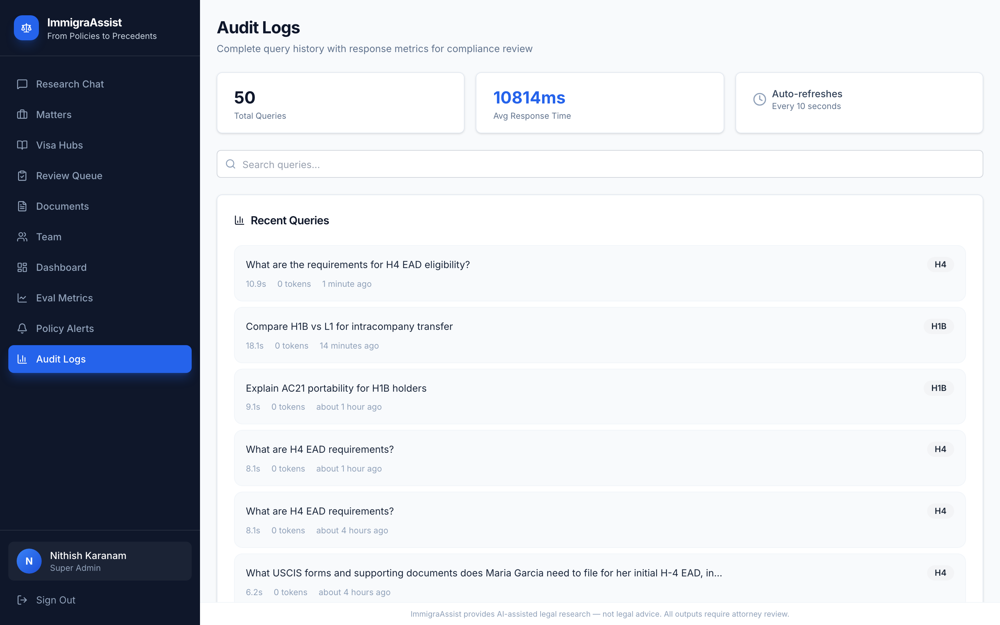

---

## What is ImmigraAssist?

ImmigraAssist is a **production-grade RAG (Retrieval-Augmented Generation)** platform for immigration law firms. It combines live USCIS data, indexed precedents, CourtListener, and GPT-4o with strict citations and attorney guardrails.

| Workflow | How it helps |
|----------|--------------|
| Quick research | Natural-language questions across visa categories |
| Client matters | Per-client case files with AI-personalized answers |
| Document review | Paste petition drafts for doc Q&A mode |
| Quality control | Review Queue for low-confidence answers |
| Compliance | Audit trail of every query and feedback |
| Policy monitoring | Automated USCIS change detection |

---

## Key Features

### Research Chat
- Streaming answers with **confidence badges** (high / medium / low)
- **10-turn session memory** — follow-ups inherit prior topic
- **Compare mode** — H-1B vs O-1, etc.
- **Doc Q&A** — paste client documents for review
- **References panel** — USCIS chapters, BIA cases, court decisions
- **Export memo** · **Thumbs up/down feedback**

### Matters
- Create matters with client name, visa type, **case notes**
- **AI injects case notes** into every prompt in that matter
- **Save to matter** from general chat
- Matter detail with **research history** and quick prompts

### Admin & Operations
- **Eval Dashboard** — live charts and KPIs
- **Review Queue** — attorney approval workflow
- **Policy Alerts** — USCIS scraper feed
- **Audit Logs** — full compliance history
- **Team invites** with role-based access

### RAG Pipeline
- Hybrid retrieval (Milvus + BM25 + RRF)
- CourtListener live search
- Visa type auto-detection
- Semantic cache (Redis)
- PII guardrails (GLiNER)
- LangSmith tracing

---

## Architecture

```
User Query → FastAPI
    ├── Session memory (10 turns)
    ├── Matter context (case notes)
    ├── Hybrid retrieval (Milvus + BM25 + CourtListener)
    ├── GPT-4o + citations
    ├── Confidence scoring
    └── Audit log + Review Queue (if flagged)
```

### Tech Stack

| Layer | Technology |
|-------|------------|
| Backend | FastAPI, Python 3.12, SQLAlchemy |
| LLM | OpenAI GPT-4o |
| Vector DB | Milvus 2.4 |
| DB / Cache | PostgreSQL 16, Redis 7, Celery |
| Frontend | React 19, TypeScript, Tailwind, Vite |
| Deploy | Docker Compose, Nginx |

---

## Knowledge Base

| Source | Documents | Vectors (approx.) |
|--------|-----------|-------------------|
| USCIS Policy Manual | 66+ | 657+ |
| BIA / AAO cases | 244 | 5,860 |
| USCIS news & alerts | 20+ | ~80 |
| **Total** | **330+** | **6,500+** |

---

## Evaluation & Metrics

| Metric | Value |
|--------|-------|
| RAGAS Answer Relevancy | **0.840** (20 test cases) |
| Avg response time | **~11s** (production) |
| Live dashboard | 15s auto-refresh at `/eval` |

```bash
cd backend && python tests/test_ragas.py
```

---

## Quick Start

```bash
git clone https://github.com/Nithishkaranam2002/ImmigraAssist.git
cd ImmigraAssist
cp backend/.env.example backend/.env   # add your keys — never commit .env
docker compose up -d
# open http://localhost
```

See [Quick Start details](#environment-variables) below for ingestion and env vars.

---

## API Reference

| Method | Endpoint | Description |
|--------|----------|-------------|
| `POST` | `/api/v1/auth/login` | Login |
| `POST` | `/api/v1/chat/query` | Ask a question |
| `POST` | `/api/v1/chat/query/stream` | Streaming chat |
| `POST` | `/api/v1/chat/doc-query` | Document Q&A |
| `GET` | `/api/v1/platform/history` | Query history |
| `GET` | `/api/v1/platform/eval-metrics` | Eval dashboard |
| `GET` | `/api/v1/matters/` | List matters |
| `POST` | `/api/v1/matters/attach-research` | Save chat to matter |
| `POST` | `/api/v1/admin/scrape/trigger` | Trigger scrapers |

Full interactive docs: `http://localhost/api/v1/docs`

---

## User Roles

| Feature | Junior | Attorney | Admin |
|---------|:------:|:--------:|:-----:|
| Research Chat / Matters / Hubs | ✅ | ✅ | ✅ |
| Review Queue | ❌ | ✅ | ✅ |
| Documents / Team / Audit / Eval / Alerts | ❌ | ❌ | ✅ |

---

## Project Structure

```
ImmigraAssist/
├── backend/app/          # FastAPI, RAG, scrapers, models
├── frontend/src/         # React pages & components
├── docs/                 # README screenshots (this gallery)
├── scripts/              # capture-screenshots.mjs
└── docker-compose.yml
```

---

## Environment Variables

| Variable | Required | Description |
|----------|----------|-------------|
| `OPENAI_API_KEY` | ✅ | OpenAI API key |
| `SECRET_KEY` | ✅ | JWT signing secret |
| `ADMIN_EMAIL` / `ADMIN_PASSWORD` | ✅ | Bootstrap admin |
| `LANGCHAIN_API_KEY` | Optional | LangSmith tracing |

Full list: [`backend/.env.example`](backend/.env.example)

### Quick Start (detailed)

```bash
cp backend/.env.example backend/.env
# Edit: OPENAI_API_KEY, SECRET_KEY, ADMIN_EMAIL, ADMIN_PASSWORD
docker compose up -d

# First-time corpus ingestion
curl -X POST http://localhost/api/v1/auth/login \
  -H "Content-Type: application/json" \
  -d '{"email":"admin@yourfirm.com","password":"yourpassword"}'
# Use token:
curl -X POST "http://localhost/api/v1/admin/scrape/trigger?scrape_policy=true&scrape_news=true&scrape_bia=true" \
  -H "Authorization: Bearer TOKEN"
```

---

## Security & Secrets

| Check | Status |
|-------|--------|
| `backend/.env` gitignored | ✅ |
| Real API keys in repo | ✅ None |
| Secrets via environment only | ✅ |

**Never commit** `backend/.env`. Rotate keys if ever exposed. Change demo password on public deployments.

---

## Development

```bash
# Regenerate all README screenshots from live app
npm install playwright   # one-time
npx playwright install chromium
node scripts/capture-screenshots.mjs

# Local dev
cd backend && uvicorn app.main:app --reload --port 8000
cd frontend && npm run dev
```

Optional env for screenshots:

```bash
SCREENSHOT_BASE_URL=http://157.230.51.229 \
SCREENSHOT_EMAIL=your@email.com \
SCREENSHOT_PASSWORD=yourpass \
node scripts/capture-screenshots.mjs
```

---

## Author

**Nithish Karanam** — MS AI, UNT · NVIDIA Certified

[GitHub](https://github.com/Nithishkaranam2002) · [LinkedIn](https://linkedin.com/in/nithishkaranam) · [Portfolio](https://nithishkaranam.lovable.app)

---

## License & Disclaimer

**MIT License** — see [LICENSE](LICENSE).

ImmigraAssist is AI **research assistance**, not legal advice. All outputs require **attorney review** before client use.
